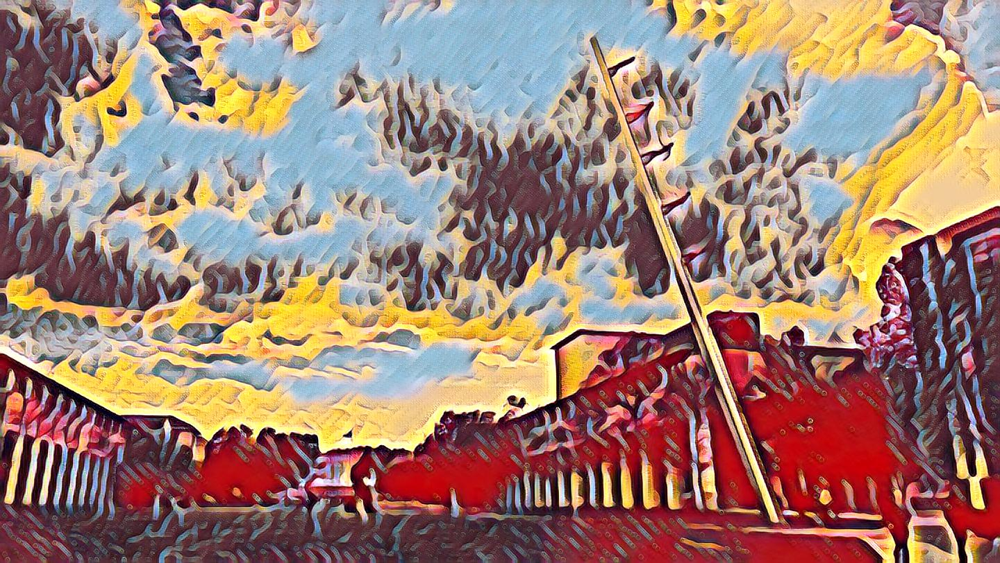

## 推荐书籍
1. Ian Goodfellow等，《深度学习》/ *Deep Learning*
2. 李航，《统计学习方法》

## 推荐课程
1. Stanford University, Fei-Fei Li/李飞飞, [CS231n: Convolutional Neural Networks for Visual Recognition](http://cs231n.stanford.edu/) / [bilibili中文字幕视频](https://www.bilibili.com/video/BV1Gb4y1X7Q5)

2. Stanford University, Andrew Ng/吴恩达， [CS229: Machine Learning](http://cs229.stanford.edu/) / [bilibili中文字幕视频](https://www.bilibili.com/video/BV1JE411w7Ub/?spm_id_from=333.788.recommend_more_video.0)

3. 台湾大学，李宏毅，**机器学习** / [bilibili视频](https://www.bilibili.com/video/BV1Wv411h7kN?from=search&seid=169234578912587402&spm_id_from=333.337.0.0)

4. Andrew Ng/吴恩达，Coursera课程，**Machine Learning** / [bilibili中文字幕视频](https://www.bilibili.com/video/BV164411b7dx?from=search&seid=9667206633028514293&spm_id_from=333.337.0.0)

5. UCL, David Silver, [Reinforcement Learning](https://www.davidsilver.uk/teaching/) / [youtube](https://www.youtube.com/watch?v=2pWv7GOvuf0)  

## 推荐UP主
1. [跟李沐学AI](https://space.bilibili.com/1567748478?from=search&seid=5943182010192296025&spm_id_from=333.337.0.0) / 亚马逊资深首席科学家，讲课和读论文
2. [同济子豪兄](https://space.bilibili.com/1900783/?spm_id_from=333.999.0.0) / 同济大学研究生，精读AI经典论文
3. [deep_thoughts](https://space.bilibili.com/373596439/?spm_id_from=333.999.0.0) / 人工智能与应用方向，直播讲解PyTorch源码
4. [Bubbliiiing](https://space.bilibili.com/472467171/?spm_id_from=333.999.0.0) / 主要讲解深度学习中各种模型平台的搭建
5. [语言观止](https://space.bilibili.com/477286107/?spm_id_from=333.999.0.0) / 英语学习，自创背词法，有利于英语的学习

## 掌握知识
1. 傅里叶变化的

## 必读论文
### 计算机视觉
1. Image Classification, **AlexNet:** Alex Krizhevsky *et.al.*, [ImageNet Classification with Deep Convolutional Neural Networks](http://www.cs.toronto.edu/~fritz/absps/imagenet.pdf) / [pytorch](https://github.com/pytorch/vision/blob/main/torchvision/models/alexnet.py)
1. Image Classification, **VGG:** Karen Simonyan and Andrew Zisserman [Very deep convolutional networks for large-scale image recognition
](https://arxiv.org/abs/1409.1556) / [pytorch](https://github.com/pytorch/vision/blob/main/torchvision/models/vgg.py)
2. Image Classification, **ResNet:** Kaiming He *et.al.*, [Deep residual learning for image recognition](https://openaccess.thecvf.com/content_cvpr_2016/html/He_Deep_Residual_Learning_CVPR_2016_paper.html) / [pytorch](https://github.com/pytorch/vision/blob/main/torchvision/models/resnet.py)
3. Semantic Segmentation, **FCN:** Jonathan Long *et.al.*, [Fully Convolutional Networks for Semantic Segmentation](https://openaccess.thecvf.com/content_cvpr_2015/html/Long_Fully_Convolutional_Networks_2015_CVPR_paper.html) / [pytorch](https://github.com/pochih/FCN-pytorch)
4. Semantic Segmentation, **U-Net:** Olaf Ronneberger *et.al.*, [U-Net: Convolutional Networks for Biomedical
Image Segmentation](https://arxiv.org/abs/1505.04597) / [pytorch](https://amaarora.github.io/2020/09/13/unet.html)
5. Instance Segmentation, **Mask R-CNN** Kaiming He *et.al.*, [Mask R-CNN](https://openaccess.thecvf.com/content_iccv_2017/html/Fang_RMPE_Regional_Multi-Person_ICCV_2017_paper.html) / [github](https://github.com/multimodallearning/pytorch-mask-rcnn)
6. Instance Segmentation, **Yolact** Daniel Bolya *et.al.*, [YOLACT: Real-Time Instance Segmentation](https://openaccess.thecvf.com/content_ICCV_2019/html/Bolya_YOLACT_Real-Time_Instance_Segmentation_ICCV_2019_paper.html) / [github](https://github.com/dbolya/yolact)
7. Object Detection, **Faster R-CNN:** Shaoqing Ren *et.al.*, [Faster r-cnn: Towards real-time object detection with region proposal networks](https://proceedings.neurips.cc/paper/2015/file/14bfa6bb14875e45bba028a21ed38046-Paper.pdf) / [pytorch](https://github.com/facebookresearch/maskrcnn-benchmark)
8. Object Detection, **SSD:** Wei Liu *et.al.*, [Ssd: Single shot multibox detector](https://www.cs.unc.edu/~wliu/papers/ssd.pdf)  / [pytorch](https://github.com/yatengLG/SSD-Pytorch)
9. Object Detection, **YOLO:** Joseph Redmon *et.al.*, [You only look once: Unified, real-time object detection](https://www.cv-foundation.org/openaccess/content_cvpr_2016/html/Redmon_You_Only_Look_CVPR_2016_paper.html) / [pytorch yolov5](https://github.com/ultralytics/yolov5)
10. Object Detection, **CenterNet:** Xingyi Zhou *et.al.*, [Objects as points](https://arxiv.org/abs/1904.07850) / [github](https://github.com/xingyizhou/CenterNet)
11. Pose Estimation, **Openpose:** Zhe Cao *et.al.*, [OpenPose: Realtime Multi-Person 2D Pose Estimation using Part Affinity Fields](https://ieeexplore.ieee.org/document/8765346) / [project pages](https://cmu-perceptual-computing-lab.github.io/openpose/web/html/doc/) / [github](https://github.com/CMU-Perceptual-Computing-Lab/openpose)
12. Pose Estimation, **AlphaPose:** Hao-Shu Fang *et.al.*, [Regional Multi-person Pose Estimation](https://openaccess.thecvf.com/content_iccv_2017/html/Fang_RMPE_Regional_Multi-Person_ICCV_2017_paper.html) / [github](https://github.com/MVIG-SJTU/AlphaPose)
13. GANs, **GAN:** Ian Goodfellow *et.al.*, [Generative Adversarial Networks](https://arxiv.org/abs/1406.2661) 
14. GANs, **Pixel2Pixel:** Phillip Isola *et.al.*, [Unpaired Image-to-Image Translation with Conditional Adversarial Networks](https://arxiv.org/abs/1611.07004) / [project pages](https://phillipi.github.io/pix2pix/)
15. GANs, **CycleGan:** Junyan Zhu *et.al.*, [Unpaired Image-to-Image Translation using Cycle-Consistent Adversarial Networks](https://junyanz.github.io/CycleGAN/) / [project pages](https://junyanz.github.io/CycleGAN/)
16. GANs, **Wasserstein GAN:** Martin Arjovsky *et.al.*, [Wasserstein GAN](https://arxiv.org/abs/1701.07875) / [code](https://github.com/eriklindernoren/PyTorch-GAN/blob/master/implementations/wgan/wgan.py)
17. Adversarial examples, Ian Goodfellow *et.al.*, [Explaining and Harnessing Adversarial Examples](https://arxiv.org/abs/1412.6572)
18. Adversarial examples, Alexey Kurakin *et.al.*, [Adversarial examples in the physical world](https://arxiv.org/abs/1607.02533v4)
19. Vision Transformer, **ViT:** Alexey Dosovitskiy *et.al.*, [An Image is Worth 16x16 Words: Transformers for Image Recognition at Scale](https://arxiv.org/abs/2010.11929) / [github](https://github.com/google-research/vision_transformer)
20. Vision Transformer, **Swin Transformer:** Ze Liu *et.al.*, [Swin Transformer: Hierarchical Vision Transformer using Shifted Windows](https://arxiv.org/pdf/2103.14030.pdf) / [github](https://github.com/microsoft/Swin-Transformer)
21. Vision Transformer, **MAE:** Kaiming He *et.al.*, [Masked Autoencoders Are Scalable Vision Learners](https://arxiv.org/abs/2111.06377)

### 无线感知
1. **Wi-Fi**, Zheng Yang *et.al.*, [From RSSI to CSI: Indoor localization via channel response](https://dl.acm.org/doi/10.1145/2543581.2543592), ACM Computing Surveys 2013
2. **Wi-Fi**, Fadel Adib and Dina Katabi [See through walls with WiFi!](https://dl.acm.org/doi/abs/10.1145/2486001.2486039), ACM SIGCOMM 2013
3. **Wi-Fi**, Kamran Ali *et.al.*, [Keystroke Recognition Using WiFi Signals](https://sigmobile.org/mobicom/2015/papers/p90-aliA.pdf), ACM Mobicom 2015
4. **Wi-Fi**, Kun Qian *et.al.*, [Inferring Motion Direction using Commodity Wi-Fi for Interactive Exergames](https://kunqian.info/publication/chi17widance/), ACM CHI 2017
5. **Wi-Fi**, Hao Wang *et.al.*, [Human Respiration Detection with Commodity WiFi Devices: Do User Location and Body Orientation Matter?](http://www-public.imtbs-tsp.eu/~zhang_da/pub/Daqing%202016%20UbiComp%20respiration.pdf), ACM UBICOMP 2016
6. **Wi-Fi**, Manikanta Kotaru *et.al.*, [SpotFi: Decimeter Level Localization Using WiFi](https://web.stanford.edu/~skatti/pubs/sigcomm15-spotfi.pdf), ACM SIGCOMM 2015
7. **Wi-Fi**, Manikanta Kotaru and Sachin Katti [Position Tracking for Virtual Reality Using Commodity WiFi](https://openaccess.thecvf.com/content_cvpr_2017/papers/Kotaru_Position_Tracking_for_CVPR_2017_paper.pdf), IEEE/CVF CVPR 2017 
8. **Wi-Fi**, Xiang Li *et.al.*, [Dynamic-MUSIC: accurate device-free indoor localization](https://dl.acm.org/doi/abs/10.1145/2971648.2971665), ACM UBICOMP 2016
9. **Wi-Fi**, Kun Qian *et.al.*, [Widar2.0: Passive Human Tracking with a Single Wi-Fi Link](https://cswu.me/papers/mobisys18_widar2.0_paper.pdf), ACM Mobisys 2018
10. **Wi-Fi**, Fei Wang *et.al.*, [Person-in-WiFi: Fine-grained Person Perception using WiFi](https://openaccess.thecvf.com/content_ICCV_2019/papers/Wang_Person-in-WiFi_Fine-Grained_Person_Perception_Using_WiFi_ICCV_2019_paper.pdf), IEEE/CVF ICCV 2019
11. **Wi-Fi**, Yue Zheng *et.al.*, [Zero-Effort Cross-Domain Gesture Recognition With Wi-Fi](http://tns.thss.tsinghua.edu.cn/widar3.0/data/MobiSys19_Widar3.0_paper.pdf), ACM Mobisys 2018/ TPAMI 2021
12. **Wi-Fi**, Donny Huang *et.al.*, [Feasibility and Limits of Wi-Fi Imaging](https://homes.cs.washington.edu/~gshyam/Papers/wision.pdf), ACM Sensys 2014
13.  **Wi-Fi**, Philipp M Holl and Friedemann Reinhard, [Holography of wi-fi radiation](https://pubmed.ncbi.nlm.nih.gov/28524674/), Physical Review Letter 2017

13. **FMCW Radar / cmWave** Fadel Adib *et.al.*, [3D Tracking via Body Radio Reflections](http://witrack.csail.mit.edu/witrack-paper.pdf), Usenix NSDI 2014 / [project pages](http://witrack.csail.mit.edu/)
14. **FMCW Radar / cmWave** Fadel Adib *et.al.*, [Multi-Person Localization via RF Body Reflections](http://witrack.csail.mit.edu/witrack2-paper.pdf), Usenix NSDI 2015
15. **FMCW Radar / cmWave** Fadel Adib *et.al.*, [Vital-Radio: Smart Homes that Monitor Breathing and Heart Rate](http://witrack.csail.mit.edu/vitalradio/content/vitalradio-paper.pdf), ACM CHI 2015 / [project pages](http://witrack.csail.mit.edu/vitalradio/)
16. **FMCW Radar / cmWave** Fadel Adib *et.al.*, [RF-Capture: Capturing the Human Figure Through a Wall](http://rfcapture.csail.mit.edu/rfcapture-paper.pdf), SIGGRAPH Asia 2015 / [project pages](http://rfcapture.csail.mit.edu/)
17. **FMCW Radar / cmWave** Mingmin Zhao *et.al.*, [Emotion Recognition using Wireless Signals](http://eqradio.csail.mit.edu/), ACM Mobicom 2016
18. **FMCW Radar / cmWave** Mingmin Zhao *et.al.*, [Through-Wall Human Pose Estimation Using Radio Signals](http://rfpose.csail.mit.edu/), IEEE/CVF CVPR 2018
19. **FMCW Radar / cmWave** Mingmin Zhao *et.al.*, [RF-Based 3D Skeletons](http://rfpose3d.csail.mit.edu/), ACM SIGCOMM 2019

20. **Acoustic FMCW** Rajalakshmi Nandakumar *et.al.*, [Contactless Sleep Apnea Detection on Smartphones](https://ucilnica.fri.uni-lj.si/pluginfile.php/8000/mod_page/content/15/NGW15.pdf), ACM Mobisys 2015
21. **Acoustic FMCW** Rajalakshmi Nandakumar *et.al.*, [Opioid overdose detection using smartphones](https://www.science.org/doi/10.1126/scitranslmed.aau8914), SCIENCE TRANSLATIONAL MEDICINE 2019
22. **Acoustic FMCW** [Using smart speakers to contactlessly monitor heart rhythms](https://www.nature.com/articles/s42003-021-01824-9#:~:text=%20Using%20smart%20speakers%20to%20contactlessly%20monitor%20heart,has%20focused%20on%20contactless%20monitoring%20of...%20More%20), Nature communications biology 2021
23. **Acoustic FMCW** Wenguang Mao *et.al.*, [CAT: high-precision acoustic motion tracking](https://dl.acm.org/doi/abs/10.1145/2973750.2973755), ACM Mobicom 2016
24. **Acoustic FMCW** Wenguang Mao *et.al.*, [AIM: Acoustic Imaging on a Mobile](https://dl.acm.org/doi/abs/10.1145/3210240.3210325), ACM MobiSys 2018
25. **Acoustic FMCW** Sangki Yun *et.al.*, [Strata: Fine-Grained Acoustic-based Device-Free Tracking](https://dl.acm.org/doi/abs/10.1145/3081333.3081356)
26. **Acoustic** Anran Wang *et.al.*, [Contactless Infant Monitoring using White Noise](https://dl.acm.org/doi/10.1145/3300061.3345453), ACM MobiCom 2019

27. **FMCW mmWave** Chengkun Jiang *et.al.*, [mmVib: Micrometer-Level Vibration Measurement with mmWave Radar](http://tns.thss.tsinghua.edu.cn/sun/publications/mmVib_MobiCom2020.pdf), ACM MobiCOM 2020

35. **RFID**, Jinsong Han *et.al.*, [GenePrint: Generic and Accurate Physical-Layer Identification for UHF RFID Tags](https://users.soe.ucsc.edu/~qian/papers/Geneprint_ToN.pdf), ICNP 2013
 
37. **RFID**, Jue Wang *et.al.*, [RF-Compass: Robot Object Manipulation Using RFIDs]([rfcompass.pdf (illinois.edu)](https://courses.engr.illinois.edu/ece598hh/sp2018/papers/rfcompass.pdf))，ACM Mobicom 2013

29. **RFID**, Lei Yang *et.al.*, [Tagoram: Real-Time Tracking of Mobile RFID Tags to High Precision Using COTS Devices](http://staff.ustc.edu.cn/~xiangyangli/paper/Conf/tagoram-mobicom.pdf), ACM Mobicom 2014

30. **RFID**, Tianci Liu *et.al.*, [Anchor-free backscatter positioning for RFID tags with high accuracy](https://ieeexplore.ieee.org/abstract/document/6847960), IEEE INFOCOM 2014

31. **RFID**, Han Ding *et.al.*, [FEMO: A Platform for Free-weight Exercise Monitoring with RFIDs](http://citeseerx.ist.psu.edu/viewdoc/download?doi=10.1.1.702.6965&rep=rep1&type=pdf), ACM SenSys 2015

32. **RFID**, Swadhin Pradhan *et.al.*, [RIO: A Pervasive RFID-based Touch Gesture Interface](https://dl.acm.org/doi/10.1145/3117811.3117818) ACM Mobicom 2017

33. **RFID**, Cui Zhao *et.al.*, [RF-Mehndi: A Fingertip Profiled RF Identifier](https://ieeexplore.ieee.org/document/8737419), IEEE INFOCOM 2019

34. **RFID**, Unsoo Ha *et.al.*, [Food and Liquid Sensing in Practical Environments using RFIDs](https://www.usenix.org/conference/nsdi20/presentation/ha), Usenix NSDI 2020

29. **LoRa** Fusang Zhang *et.al.*, [Exploring LoRa for Long-range Through-wall Sensing](https://dl.acm.org/doi/abs/10.1145/3397326), ACM IMWUT 2020
30. **LoRa** Binbin Xie and Jie Xiong, [Combating interference for long range LoRa sensing](https://dl.acm.org/doi/10.1145/3384419.3430731), ACM Sensys 2020 
31. **LoRa** Binbin Xie *et.al.*, [Pushing the Limits of Long Range Wireless Sensing with LoRa](https://dl.acm.org/doi/abs/10.1145/3478080), ACM IMWUT 2021

32. **Visual Light** 

33 **Smart Phones**

34 **Smartwatches** 

## 群组文档
1. 每周论文阅读：查看**Slack, paper-digest**的频道公告

2. 科技文写作字典：查看**Slack, paper-digest**的频道公告，添加词句在频道内@MengDie

3. 设备/材料/图书-领用记录文档：查看**Slcak, 全体/All**的频道公告，领用后@MengDie即刻更新

## 校园生活
1. 正版软件下载：[网络信息中心](http://nic.xjtu.edu.cn/)

2. 校外访问校园网：[校园VPN](http://vpn.xjtu.edu.cn/)

3. 校园卡充值：可在**支付宝-校园一卡通**在线充值,延迟几分钟到账

## Sponsors and Partners

  
 
 
 

