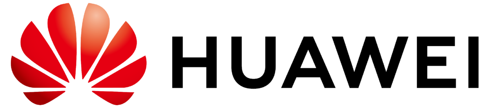

## 推荐书籍
1. Ian Goodfellow等，《深度学习》/ *Deep Learning*
2. 李航，《统计学习方法》

## 推荐课程
1. Stanford University, Fei-Fei Li/李飞飞, [CS231n: Convolutional Neural Networks for Visual Recognition](http://cs231n.stanford.edu/) / [bilibili中文字幕视频](https://www.bilibili.com/video/BV1Gb4y1X7Q5)

2. Stanford University, Andrew Ng/吴恩达， [CS229: Machine Learning](http://cs229.stanford.edu/) / [bilibili中文字幕视频](https://www.bilibili.com/video/BV1JE411w7Ub/?spm_id_from=333.788.recommend_more_video.0)

3. 台湾大学，李宏毅，**机器学习** / [bilibili视频](https://www.bilibili.com/video/BV1Wv411h7kN?from=search&seid=169234578912587402&spm_id_from=333.337.0.0)

4. Andrew Ng/吴恩达，Coursera课程，**Machine Learning** / [bilibili中文字幕视频](https://www.bilibili.com/video/BV164411b7dx?from=search&seid=9667206633028514293&spm_id_from=333.337.0.0)

5. UCL, David Silver, [Reinforcement Learning](https://www.davidsilver.uk/teaching/) / [youtube](https://www.youtube.com/watch?v=2pWv7GOvuf0)  

## 推荐UP主
1. [跟李沐学AI](https://space.bilibili.com/1567748478?from=search&seid=5943182010192296025&spm_id_from=333.337.0.0) / 亚马逊资深首席科学家，讲课和读论文

## 掌握知识
1. 傅里叶变化的

## 必读论文
### 计算机视觉
1. Image Classification, **AlexNet:** Alex Krizhevsky *et.al.*, [ImageNet Classification with Deep Convolutional Neural Networks](http://www.cs.toronto.edu/~fritz/absps/imagenet.pdf) / [pytorch](https://github.com/pytorch/vision/blob/main/torchvision/models/alexnet.py)
1. Image Classification, **VGG:** Karen Simonyan and Andrew Zisserman [Very deep convolutional networks for large-scale image recognition
](https://arxiv.org/abs/1409.1556) / [pytorch](https://github.com/pytorch/vision/blob/main/torchvision/models/vgg.py)
2. Image Classification, **ResNet:** Kaiming He *et.al.*, [Deep residual learning for image recognition](https://openaccess.thecvf.com/content_cvpr_2016/html/He_Deep_Residual_Learning_CVPR_2016_paper.html) / [pytorch](https://github.com/pytorch/vision/blob/main/torchvision/models/resnet.py)
3. Semantic Segmentation, **FCN:** Jonathan Long *et.al.*, [Fully Convolutional Networks for Semantic Segmentation](https://openaccess.thecvf.com/content_cvpr_2015/html/Long_Fully_Convolutional_Networks_2015_CVPR_paper.html) / [pytorch](https://github.com/pochih/FCN-pytorch)
4. Semantic Segmentation, **U-Net:** Olaf Ronneberger *et.al.*, [U-Net: Convolutional Networks for Biomedical
Image Segmentation](https://arxiv.org/abs/1505.04597) / [pytorch](https://amaarora.github.io/2020/09/13/unet.html)
5. Instance Segmentation, **Mask R-CNN** Kaiming He *et.al.*, [Mask R-CNN](https://openaccess.thecvf.com/content_iccv_2017/html/Fang_RMPE_Regional_Multi-Person_ICCV_2017_paper.html) / [github](https://github.com/multimodallearning/pytorch-mask-rcnn)
6. Instance Segmentation, **Yolact** Daniel Bolya *et.al.*, [YOLACT: Real-Time Instance Segmentation](https://openaccess.thecvf.com/content_ICCV_2019/html/Bolya_YOLACT_Real-Time_Instance_Segmentation_ICCV_2019_paper.html) / [github](https://github.com/dbolya/yolact)
7. Object Detection, **Faster R-CNN:** Shaoqing Ren *et.al.*, [Faster r-cnn: Towards real-time object detection with region proposal networks](https://proceedings.neurips.cc/paper/2015/file/14bfa6bb14875e45bba028a21ed38046-Paper.pdf) / [pytorch](https://github.com/facebookresearch/maskrcnn-benchmark)
8. Object Detection, **SSD:** Wei Liu *et.al.*, [Ssd: Single shot multibox detector](https://www.cs.unc.edu/~wliu/papers/ssd.pdf)  / [pytorch](https://github.com/yatengLG/SSD-Pytorch)
9. Object Detection, **YOLO:** Joseph Redmon *et.al.*, [You only look once: Unified, real-time object detection](https://www.cv-foundation.org/openaccess/content_cvpr_2016/html/Redmon_You_Only_Look_CVPR_2016_paper.html) / [pytorch yolov5](https://github.com/ultralytics/yolov5)
10. Object Detection, **CenterNet:** Xingyi Zhou *et.al.*, [Objects as points](https://arxiv.org/abs/1904.07850) / [github](https://github.com/xingyizhou/CenterNet)
11. Pose Estimation, **Openpose:** Zhe Cao *et.al.*, [OpenPose: Realtime Multi-Person 2D Pose Estimation using Part Affinity Fields](https://ieeexplore.ieee.org/document/8765346) / [project pages](https://cmu-perceptual-computing-lab.github.io/openpose/web/html/doc/) / [github](https://github.com/CMU-Perceptual-Computing-Lab/openpose)
12. Pose Estimation, **AlphaPose:** Hao-Shu Fang *et.al.*, [Regional Multi-person Pose Estimation](https://openaccess.thecvf.com/content_iccv_2017/html/Fang_RMPE_Regional_Multi-Person_ICCV_2017_paper.html) / [github](https://github.com/MVIG-SJTU/AlphaPose)
13. GANs, **GAN:** Ian Goodfellow *et.al.*, [Generative Adversarial Networks](https://arxiv.org/abs/1406.2661) 
14. GANs, **Pixel2Pixel:** Phillip Isola *et.al.*, [Unpaired Image-to-Image Translation with Conditional Adversarial Networks](https://arxiv.org/abs/1611.07004) / [project pages](https://phillipi.github.io/pix2pix/)
15. GANs, **CycleGan:** Junyan Zhu *et.al.*, [Unpaired Image-to-Image Translation using Cycle-Consistent Adversarial Networks](https://junyanz.github.io/CycleGAN/) / [project pages](https://junyanz.github.io/CycleGAN/)
16. GANs, **Wasserstein GAN:** Martin Arjovsky *et.al.*, [Wasserstein GAN](https://arxiv.org/abs/1701.07875) / [code](https://github.com/eriklindernoren/PyTorch-GAN/blob/master/implementations/wgan/wgan.py)
17. Adversarial examples, Ian Goodfellow *et.al.*, [Explaining and Harnessing Adversarial Examples](https://arxiv.org/abs/1412.6572)
18. Adversarial examples, Alexey Kurakin *et.al.*, [Adversarial examples in the physical world](https://arxiv.org/abs/1607.02533v4)

#### Generative Adversarial Networks

## 群组文档
1. 每周论文阅读：查看**Slack, paper-digest**的频道公告

2. 科技文写作字典：查看**Slack, paper-digest**的频道公告，添加词句在频道内@MengDie

3. 设备/材料/图书-领用记录文档：查看**Slcak, 全体/All**的频道公告，领用后@MengDie即刻更新

## 校园生活
1. 正版软件下载：[网络信息中心](http://nic.xjtu.edu.cn/)

2. 校外访问校园网：[校园VPN](http://vpn.xjtu.edu.cn/)

3. 校园卡充值：可在**支付宝-校园一卡通**在线充值,延迟几分钟到账

## Sponsors and Partners

  
  
 

