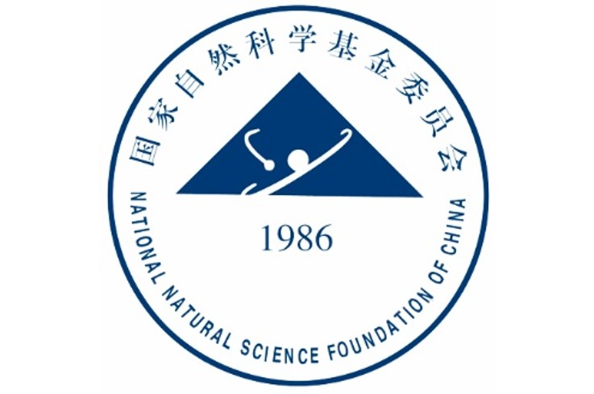

## 推荐书籍
1. Ian Goodfellow等，《深度学习》/ *Deep Learning*
2. 李航，《统计学习方法》

## 推荐课程
1. Stanford University, Fei-Fei Li/李飞飞, [CS231n: Convolutional Neural Networks for Visual Recognition](http://cs231n.stanford.edu/) / [bilibili中文字幕视频](https://www.bilibili.com/video/BV1Gb4y1X7Q5)

2. Stanford University, Andrew Ng/吴恩达， [CS229: Machine Learning](http://cs229.stanford.edu/) / [bilibili中文字幕视频](https://www.bilibili.com/video/BV1JE411w7Ub/?spm_id_from=333.788.recommend_more_video.0)

3. 台湾大学，李宏毅，**机器学习** / [bilibili视频](https://www.bilibili.com/video/BV1Wv411h7kN?from=search&seid=169234578912587402&spm_id_from=333.337.0.0)

4. Andrew Ng/吴恩达，Coursera课程，**Machine Learning** / [bilibili中文字幕视频](https://www.bilibili.com/video/BV164411b7dx?from=search&seid=9667206633028514293&spm_id_from=333.337.0.0)

5. UCL, David Silver, [Reinforcement Learning](https://www.davidsilver.uk/teaching/) / [youtube](https://www.youtube.com/watch?v=2pWv7GOvuf0)  

## 推荐UP主
1. [跟李沐学AI](https://space.bilibili.com/1567748478?from=search&seid=5943182010192296025&spm_id_from=333.337.0.0) / 亚马逊资深首席科学家

## 掌握知识
1. 傅里叶变化的

## 必读论文
### 计算机视觉
#### Image Classification
1. **ResNet:** Kaiming He *et.al.*, [Deep residual learning for image recognition](https://openaccess.thecvf.com/content_cvpr_2016/html/He_Deep_Residual_Learning_CVPR_2016_paper.html) / [pytorch code](https://github.com/pytorch/vision/blob/main/torchvision/models/resnet.py)

#### Senmatic Segmentation
2. **U-Net:** Olaf Ronneberger *et.al.*, [U-Net: Convolutional Networks for Biomedical
Image Segmentation](https://arxiv.org/abs/1505.04597) / [pytorch code](https://amaarora.github.io/2020/09/13/unet.html)

#### Object Detection

#### Pose Estimation

#### Generative Adversarial Networks

## 群组文档
1. 每周论文阅读：查看**Slack, paper-digest**的频道公告

2. 科技文写作字典：查看**Slack, paper-digest**的频道公告，添加词句在频道内@MengDie

3. 设备/材料/图书-领用记录文档：**查看Slcak, 全体/All**的频道公告，资产领用后@MengDie即刻更新

## 校园生活
1. 正版软件下载：[网络信息中心](http://nic.xjtu.edu.cn/)

2. 校外访问校园网：[校园VPN](http://vpn.xjtu.edu.cn/)

3. 校园卡充值：可在**支付宝-校园一卡通**在线充值,延迟几分钟到账

## Sponsors and Partners

  
  
 

